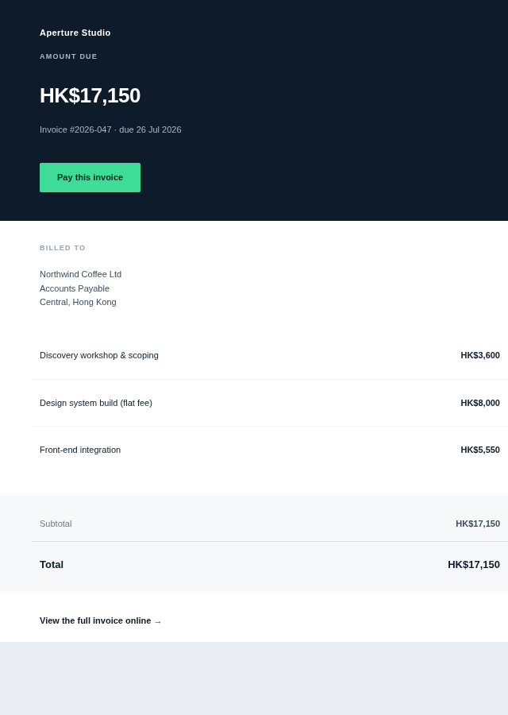
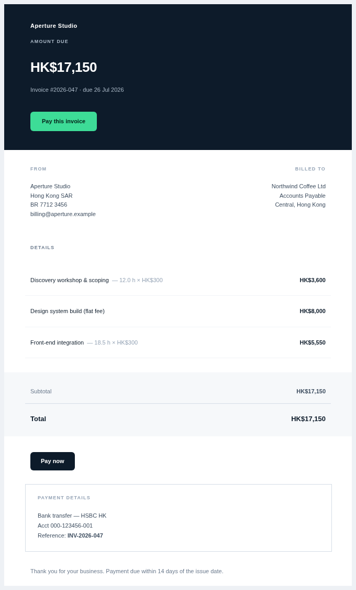
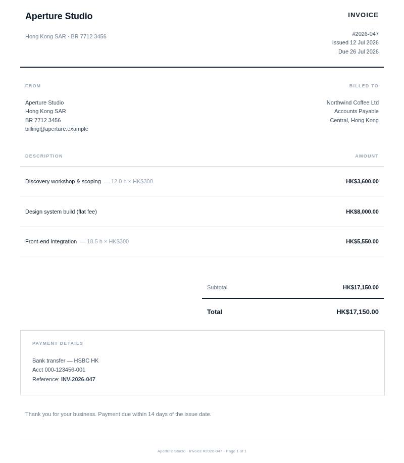
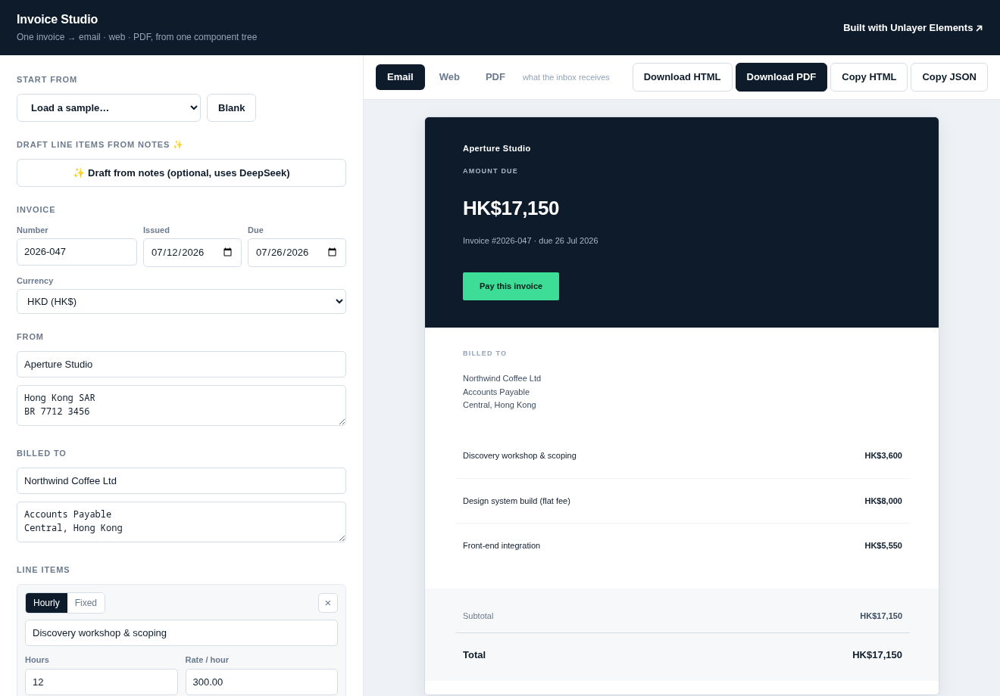

# Invoice Studio — one invoice, three fitted renders

A contractor invoice builder, and the template engine under it, built on [Unlayer Elements](https://github.com/unlayer/elements). You fill in the invoice on the left and watch it render live as an **email**, a **web page**, and a **PDF** on the right — all from a single component tree. The point isn't that the same design renders three times, it's that each render is deliberately fitted to what its medium can actually do.

**▶ Live app: [elements-invoice.pages.dev](https://elements-invoice.pages.dev/)** · Built for the **Build with Elements Challenge** · `#BuiltWithElements`

<table>
<tr>
<td width="33%"><b>Email</b><br><sub>inbox — squared, summary, bulletproof CTA</sub></td>
<td width="33%"><b>Web</b><br><sub>hosted link — rounded, full breakdown, real actions</sub></td>
<td width="33%"><b>PDF</b><br><sub>filed record — no band, legal detail, page furniture</sub></td>
</tr>
<tr>
<td valign="top"></td>
<td valign="top"></td>
<td valign="top"></td>
</tr>
</table>

## The app

[](https://elements-invoice.pages.dev/)

Invoice Studio is a single-page builder with the editor on the left and a live preview on the right. Every keystroke re-renders the invoice through Elements into an iframe, and the **Email / Web / PDF** tabs let you flip between the three renders of the exact invoice you're editing — which is the whole Elements story made interactive, since most invoice tools only ever hand you a PDF. You can load one of three sample freelancers to start from, edit every field, download the HTML for any mode, and download the PDF straight from the browser's print dialog. There's no backend, no signup, and nothing leaves the page.

It reuses the template engine below untouched — the app is a thin editor and preview shell around the same `builders`, `computeTotals`, and adapters that the command-line renderer uses.

```bash
npm install
npm run dev        # opens the app on localhost
```

There's also an optional "draft from notes" box that turns a freeform line like *"api work tues–thurs ~14h, plus the logo redesign flat 5k"* into editable line items with DeepSeek. It's gated behind a key you enter yourself, off by default, and it never touches the totals, since an invoice is a legal document and I wouldn't trust un-reviewed model output to do the math on one.

## Why an invoice

Most email templates are a marketing send — one medium, one job. An invoice is the rare document a freelancer genuinely needs in all three forms at once: emailed so the client sees the amount and a pay button, hosted so they can open it later without digging through their inbox, and saved as a PDF so it survives in an accounting folder. Today that usually means three separate tools and three chances for the numbers to disagree with each other. Elements lets the whole thing come from one typed source, and the money is computed once.

I bill hourly contract work every month, so the shape here is drawn from a real workflow rather than guessed — hours and a rate, the occasional flat fee, a deposit already paid, and a bank reference the client has to quote when they transfer. All the data in this repo is fictional, but the structure is the one I actually use.

## What "fitted to the medium" means

Every difference between the three renders is a deliberate call, not an accident of the format. This is the part I'd most want a reader to take away, so here's each one and the reasoning:

| | Email | Web | PDF (document) |
|---|---|---|---|
| **Corners** | squared | rounded + shadow | flat |
| **Line items** | summary (description + amount) | full rate breakdown (`12.0 h × HK$300`) | full breakdown + 2-decimal precision |
| **Call to action** | one bulletproof pay button | pay button + bank details | no buttons — bank details + payment reference |
| **Header band** | dark, pinned with `bgcolor` | dark | **dropped, hierarchy from rule weight** |
| **Extras** | preheader + "view online" fallback | responsive, download link | column headers, `Page 1 of 1` footer |

A few of those are worth expanding:

**The email squares its corners** because Outlook on Windows renders through Word's engine and silently drops `border-radius`, so a rounded card there degrades into a ragged one. Rather than let the medium break the design, the email commits to squared corners on purpose and the web version — where browsers can have nice things — brings the radius and shadow back.

**The email is a summary and the web/PDF are the full record.** The inbox render's job is to get the client to pay, so it shows the description and the amount and keeps the per-hour math one tap away in the web copy. The web and PDF versions have room to justify every number, so each hourly line spells out the hours and the rate.

**The PDF drops the dark header band entirely.** A full-bleed dark band costs a surprising amount of toner and streaks on a cheap office printer, and accountants do still print these. So instead of carrying the band onto paper, the document earns its hierarchy from rule weight and type — a light masthead over a 2px rule — which also happens to make the three renders read as visibly distinct artifacts rather than three copies of one screenshot.

**The PDF has no buttons at all**, because paper can't be clicked. The call to action there becomes the bank details and a payment reference to quote, which is what the medium can actually carry.

## The three personas

The same template, three plausible freelancers, to show the data model stretches without changing the component tree:

| Persona | Exercises | Email · Web · PDF |
|---|---|---|
| **Dev, hourly** | hourly + one flat fee, HKD | [email](docs/showcase/dev-hourly.email.png) · [web](docs/showcase/dev-hourly.web.png) · [pdf](docs/showcase/dev-hourly.pdf) |
| **Designer, fixed fee** | fixed lines, a returning-client discount, VAT, EUR | [email](docs/showcase/designer-fixed.email.png) · [web](docs/showcase/designer-fixed.web.png) · [pdf](docs/showcase/designer-fixed.pdf) |
| **Photographer** | day rate + reimbursable expenses + a deposit already paid → balance due, GBP | [email](docs/showcase/photographer-expenses.email.png) · [web](docs/showcase/photographer-expenses.web.png) · [pdf](docs/showcase/photographer-expenses.pdf) |

## How it works

The whole thing hangs off one typed contract, `InvoiceData`. Everything downstream of it is deterministic, so the same input always produces the same three files.

```
raw input → adapter → InvoiceData → computeTotals() → entry composes sections
          → renderToHtml() → .html   → (document only) Playwright → .pdf
```

- **`src/compute.ts`** does all the money math in integer minor units (cents), never floating point, and rounds each line once so the printed column always adds up to the printed subtotal. It's the most-tested file in the repo.
- **`src/sections/`** are the reusable pieces — header, parties, line items, totals, payment block — each a function that takes `(data, mode)` and returns Elements `<Row>`s. All the per-medium divergence lives here, keyed off `mode`.
- **`src/entries/invoice.tsx`** has the three builders side by side. Each wraps the *same* section calls in `<Email>` / `<Page>` / `<Document>`. Reading that one file is the quickest way to see that it really is one tree fitted three ways.
- **`app/`** is the Vite React app — an editor and a live iframe preview that call the same builders. It imports the engine directly and adds no rendering logic of its own, so the app and the batch renderer always produce identical output.

One thing worth flagging for anyone building on Elements: `renderToHtml` picks the output shell from the root element's `displayName`, so you have to hand it an `<Email>` / `<Page>` / `<Document>` element directly. Wrap the tree in a component of your own and you silently get the web shell instead. That's why the entries are builder functions returning the wrapper, not React components.

## Running it

Requires Node 22+.

```bash
npm install
npm run dev                       # the app on localhost

npm run render                    # batch: writes out/*.html, out/*.pdf, out/screenshots/*.png
npm test                          # 43 tests: money math, adapters, render contract
npm run build                     # static build of the app → dist/
```

Two ways to use it. `npm run dev` opens Invoice Studio for interactive editing. `npm run render` is the headless batch path — it regenerates every artifact for all three personas into `out/`, which is what the screenshots in this README come from and what a CI job would run. The `.email.html` files are what an email client receives, the `.web.html` files are the hosted page, and the `.pdf` files are print-ready. The batch PDF + screenshot steps need Chromium (`npx playwright install chromium`); the app's own "Download PDF" uses your browser's print dialog and needs nothing.

## Data adapters

`InvoiceData` is the boundary, and there are a few ways to produce one:

- **`src/adapters/json.ts`** validates an untrusted object and throws an actionable error with the exact path when something's wrong, so a bad `lineItems[2].hours` tells you so instead of rendering a broken invoice.
- **`src/adapters/timesheet-csv.ts`** turns a `date,description,hours` CSV — the shape of a real timesheet export — into an invoice, merging rows that share a description and summing their hours into one clean line.
- **`src/adapters/freeform-deepseek.ts`** is an optional extra that drafts line items from a freeform note like *"api work tues–thurs, ~14h, plus the logo redesign flat 5k"* using DeepSeek. It's kept deliberately off the render path and returns a *draft* for a human to review, since an invoice is a legal document and I wouldn't trust un-reviewed model output to do the math on one. It needs `DEEPSEEK_API_KEY` and nothing else calls it.

## Tech

TypeScript, React 18, Vite for the app, [`@unlayer/react-elements`](https://github.com/unlayer/elements) for the rendering, Playwright for the batch HTML-to-PDF step and screenshots, Vitest for tests, deployed on Cloudflare Pages. Elements does the hard part — email-safe HTML, responsive web, and print HTML from one component tree — and the only thing it doesn't do is the final PDF conversion, which the app hands to the browser's print dialog and the batch renderer hands to Playwright, since the library stops at print-ready HTML by design.

## License

MIT
